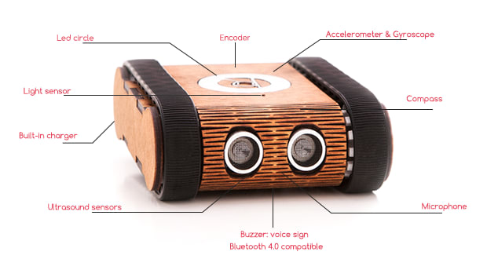

# Codie — BLE vezérlés Raspberry Pi 5-ről



*A Codie oktatórobot és szenzorai (kép: bayer.hu).*

A [csorbazoli/CodieController](https://github.com/csorbazoli/CodieController) 2016-os,
félbehagyott Java PoC-jából visszafejtett wire-protokoll tiszta Python implementációja.
A **Codie** oktatórobotot közvetlen Bluetooth Low Energy-n (BlueZ) vezérli — az a láncszem,
ami 2019-ben hiányzott (PC-oldali BLE út), Linuxon triviális.

A protokoll- és hardverrészletek a [CLAUDE.md](CLAUDE.md)-ben; a fejlődési napló a
[MEMORY.md](MEMORY.md)-ben; a verziónkénti változások a [CHANGELOG.md](CHANGELOG.md)-ben.
Aktuális verzió: **v0.7.0** (MCP szerver a Hermes-integrációhoz).

## Projekt struktúra

```
codie/            Python package
  protocol.py     wire-protokoll (frame encode/decode, parancs-ID-k, szín-HSV 0-255)
  client.py       CodieClient — aszinkron bleak kliens (aktuátor/szenzor/hang)
  morse.py        szöveg → Morse-ritmus
  tunes.py        beépített ritmusminták
  mcp_server.py   FastMCP réteg a Hermes/agent integrációhoz (9 tool)
scripts/
  test_all.py         teljes funkció-teszt (sensors|beep|led|drive)
  led.py, led_sweep.py  LED-tesztek
  battery.py          akku SoC + feszültség trend
  mic_beep.py         a robot hallja a saját beepjét (burkoló)
  play.py             ritmus / Morse / beep CLI
  fft_pitch.py        hangfelvétel domináns frekvenciája (FFT)
  verify_directions.py  mozgásirányok élő igazolása
tests/            protokoll + Morse + MCP smoke (27 unit teszt)
docs/comApi.h     hivatalos Codie BLE API header (referencia)
```

## Teszt eredmények (2026-07-07 — minden funkció élőben igazolva)

| Kategória | Funkció | Állapot |
|-----------|---------|---------|
| Szenzor | akku (SoC), fény, vonal, szonár, mikrofon | ✅ objektív adat, bájtra pontos dekódolás |
| Hang | SpeakBeep | ✅ hallható |
| Mozgás | DriveSpeed, DriveDistance, DriveTurn | ✅ kerekek pörögtek (alacsony akkun is) |
| Fény | LedSetColor (mind a 12 + egyesével) | ✅ vizuálisan igazolt, helyes színek, erős fény |

Minden parancsot a robot `nSuccessful=0`-val nyugtázott. A protokollt a hivatalos
Codie BLE API v1.0 (`docs/comApi.h`) teljesen igazolta.

## Telepítés

```bash
python3 -m venv .venv
.venv/bin/pip install -r requirements.txt
cp .env.example .env      # majd töltsd ki a robot BLE címét
```

A robot címét megtalálod:

```bash
bluetoothctl scan le      # keresd a "Codie" nevű eszközt
```

## Használat

```python
import asyncio
from codie import CodieClient

async def main():
    async with CodieClient("DF:74:94:43:36:ED") as c:
        await c.beep(700)                 # sípol
        await c.led_all("red")            # mind a 12 LED piros
        print("akku:", await c.battery(), "%")
        await c.drive_speed(30, 30)       # előre 30%
        await asyncio.sleep(1)
        await c.stop()

asyncio.run(main())
```

## Teljes funkció-teszt

A robot **az oldalán, töltőn** feküdjön — a kerekek szabadon pörögnek, de a robot nem
szalad le az asztalról.

```bash
.venv/bin/python scripts/test_all.py            # minden
.venv/bin/python scripts/test_all.py sensors    # csak szenzorok
.venv/bin/python scripts/test_all.py led drive  # csak LED + mozgás
```

## Hang: ritmus és Morse

A hangszóró fix hangmagasságú csipogó (nincs WAV/dallam), de a ritmus vezérelhető:

```bash
.venv/bin/python scripts/play.py tune shave_haircut   # beépített ritmus
.venv/bin/python scripts/play.py morse "SOS"          # Morse-kód
.venv/bin/python scripts/play.py list                 # elérhető ritmusok
```

A csipogó **hangmagassága** telefonos felvételből mérhető (a robot mikrofonja erre kevés):

```bash
.venv/bin/python scripts/play.py beep 3000            # hosszú beep a felvételhez
# ...vedd fel telefonnal, majd:
.venv/bin/python scripts/fft_pitch.py felvetel.m4a    # domináns frekvencia + felharmonikusok
```

Rendszerfüggőség az FFT-elemzéshez: `ffmpeg` (a felvétel dekódolásához).

## MCP szerver (Hermes / agent integráció)

A `codie/mcp_server.py` a klienst MCP-toolként publikálja, hogy a Hermes Agent (vagy bármely
MCP-kliens) magas szintű, biztonságos parancsokkal vezérelje a robotot. Tartós BLE-kapcsolat
reconnect-tel; csak véges, magától megálló mozgásparancsok (nincs runaway).

Futtatás (stdio):

```bash
CODIE_ADDRESS=DF:74:94:43:36:ED .venv/bin/python -m codie.mcp_server
```

### Hermes bekötés

A Hermes a `~/.hermes/config.yaml` `mcp_servers` kulcsa alatt tartja az MCP-szervereket. Mivel a
Hermes sémájában **nincs `cwd` mező**, a package elérését `PYTHONPATH`-szal adjuk meg (és a stdio
szerver csak az explicit `env`-et kapja, ezért a címet is oda tesszük):

```yaml
mcp_servers:
  codie:
    command: "/path/to/codie/.venv/bin/python"
    args: ["-m", "codie.mcp_server"]
    env:
      PYTHONPATH: "/path/to/codie"
      CODIE_ADDRESS: "DF:74:94:43:36:ED"
      CODIE_ADAPTER: "hci0"
    connect_timeout: 30                   # az első tool-hívás BLE-connectje ~10-15 mp
    timeout: 30                           # hosszabb say_morse / mozgás miatt
    supports_parallel_tool_calls: false   # egy BLE-link, egy robot -> soros végrehajtás
```

> A `/path/to/codie`-t cseréld a klón tényleges abszolút útjára (ez a helyi
> `~/.hermes/config.yaml`-ba kerül, ami nincs verziózva).

A Hermes a toolokat `mcp_codie_<tool>` néven látja (pl. `mcp_codie_drive_forward`). Config után a
`/reload-mcp` frissíti a kapcsolatot. A szerver **lustán csatlakozik**: azonnal indul, az első
tool-hívás nyit BLE-kapcsolatot.

Toolok: `status`, `look_ahead`, `drive_forward(cm)`, `drive_backward(cm)`, `turn(deg)`,
`stop`, `beep(ms)`, `say_morse(text)`, `set_leds(color)`.

### Hermes skill (playbook)

A toolok a „kezek", de az agentnek playbook is kell — ezt adja a
`hermes/skills/robotics/codie-robot/SKILL.md`: mikor és hogyan használja a robotot (érzékelj
mozgás előtt, csak véges parancs, töltő↔LED ütközés, fix csipogó, BLE-késleltetés, biztonság).
A skill `requires_tools`-szal a `mcp_codie_*` toolokhoz kötött — csak akkor bukkan fel, ha a
szerver be van kötve.

Hogy a Hermes lássa, a `~/.hermes/config.yaml`-ban mutass rá a repó skill-könyvtárára (így
verziózva marad):

```yaml
skills:
  external_dirs:
    - /path/to/codie/hermes/skills
```

Vagy másold be: `cp -r hermes/skills/robotics ~/.hermes/skills/`. Hívható a `/codie-robot`
slash-sel is.

## Unit tesztek (robot nélkül)

```bash
.venv/bin/python -m unittest discover -s tests -v
```

## Parancsok

| Metódus | Parancs | Megjegyzés |
|---------|---------|-----------|
| `beep(ms)` | SpeakBeep | max 10000 ms |
| `play_rhythm(pattern)` / `play_morse(text)` / `play_tune(name)` | SpeakBeep sorozat | fix hangmagasság → **ritmus**, nem dallam |
| `led_all(color)` / `led_single(color, idx)` | LedSetColor | színek: white, green, red, blue, cyan, yellow, orange |
| `drive_speed(l, r)` | DriveSpeed | -100..100 % |
| `drive_distance(mm, l, r)` | DriveDistance | mm + kerék-sebességek |
| `drive_turn(deg, speed)` | DriveTurn | fok + sebesség |
| `battery()` | BatteryGetSoc | % |
| `light()` / `line()` / `sonar()` / `mic()` | szenzorok | raw / mm |
